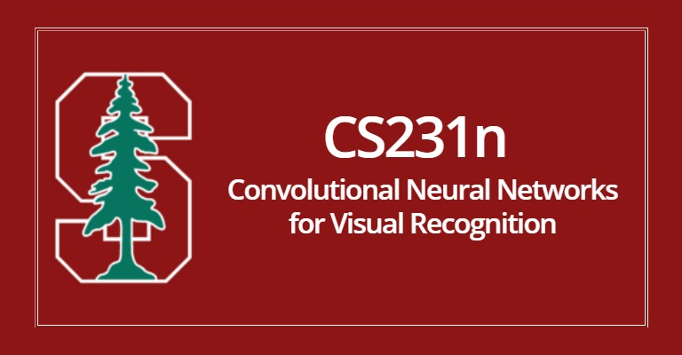

# CS231N

- Course Link: [CS231N](https://cs231n.stanford.edu/2025/)
- Lectures : [Youtube](https://www.youtube.com/playlist?list=PLoROMvodv4rOmsNzYBMe0gJY2XS8AQg16)
- Prerequisites: Multivariable Calculus, Probability, Linear Algebra, python

- Rating: **5/5**

- Review: Probably the first course to go for if you are interested in AI. It mainly focuses on deep learning through computer vision but you do get a general idea of the whole field as deep learning sort of kicked off from CV. There is a new lecture playlist recoreded and posted recently so I encourage to watch that one and be up to date. You do need a bachelors level of math that ive mentioned above. The lectures are amazing and you will learn a lot from the suggested readings as well.
- There are a quite a lot of labs you need to finish but its not super hard if you look at it one by one. And its quite fun to finish. 
- I highly recommend that you start this course if you are interested in AI I don't have to explain a lot as this course is sort of the go-to course as a uni level beginner. Good luck!

