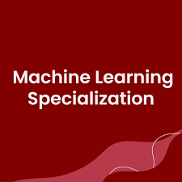

# Machine Learning Specialization 

- Course Link: [MachineLearning](https://www.coursera.org/specializations/machine-learning-introduction)

- Prerequisites: python. (Linear Algebra and Multivariable Calculus is a huge boost) 

- Rating: **4/5**

- Review: If you're looking for an introductory course to AI/ML, this is a great place to start. It covers the fundamentals of machine learning in a short amount of time and is extremely beginner-friendly — you technically don’t need any prior math knowledge to follow along. The lectures are much easier compared to an actual university course, making it accessible to a wide range of learners.

That said, having some background in linear algebra and multivariable calculus can really speed things up, as you won’t need to rewatch lectures to understand certain concepts.

The labs are very simple — you mostly fill in small portions of code. One helpful tip: use vectorized operations instead of for-loops. It not only makes the code cleaner but also runs much faster.

While there is a fee to fully enroll, the course is manageable enough that you can realistically complete it within a month if you're committed. This course is ideal if you want a quick, solid grasp of ML as a stepping stone for deeper studies. Just keep in mind that it won’t provide a deep theoretical understanding or advanced coding skills — it's more of a launchpad than a deep dive. 
