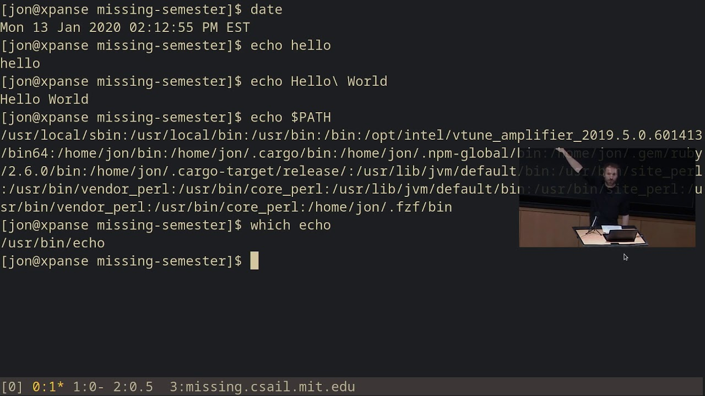

#Missing Semester of your CS education

- Course Link: [missing semester of your CS education](https://missing.csail.mit.edu/)

- Prerequisites: None

- Rating: **3/5**

- Review: This course provides all the essential tools you need beyond conventional CS courses. You’ll learn how to use the shell, work with editors like Vim, manage projects with Git, and explore many other practical tools.

- Each topic is introduced through brief video lectures, but to gain a deeper understanding, you’ll need to read the provided text and external links. This course doesn’t offer an in-depth exploration of each subject since it serves more as an introduction to various tools. However, that’s not a drawback—the goal is to familiarize you with these tools, so you can explore them further when needed.

- I rated this course 3 out of 5 because I didn’t particularly enjoy going through it. However, many of the tools covered are widely used, and I feel confident that everything I learned here will be useful in the future. The course also serves as a great reference, making it easy to revisit and review topics when necessary.

- As a side note, this blog itself is hosted using GitHub Pages, which was covered in the course! Definitely worth going through.
