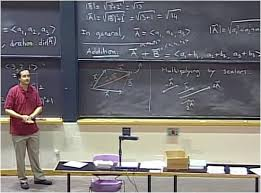

# MultivariableCalculus

- Course Link: [MultivariableCalculus](https://ocw.mit.edu/courses/18-02-multivariable-calculus-fall-2007/)

- Prerequisites: SingleVariable Calculus (highschool calculus)  

- Rating: **4/5**
- Review: This course provides a solid understanding of Multivariable Calculus, a subject widely used in engineering, physics, and many other fields. Unlike rigorous, theory-heavy calculus courses, this one takes a more practical approach, making it especially suitable for engineers. However, it still covers everything you need to understand its various applications.

- I followed the official course website to watch the lectures and then studied the corresponding sections in the textbook. The website provides a readings section that helps you match the book’s content with the lectures. The difficulty level of the book’s exercises is well-balanced, so I highly recommend this approach for self-study.

- Additionally, the notes and exams available on the course website are excellent resources if you want to go deeper into the subject.

- Overall, this is a great course for anyone looking to strengthen their understanding of Multivariable Calculus.
